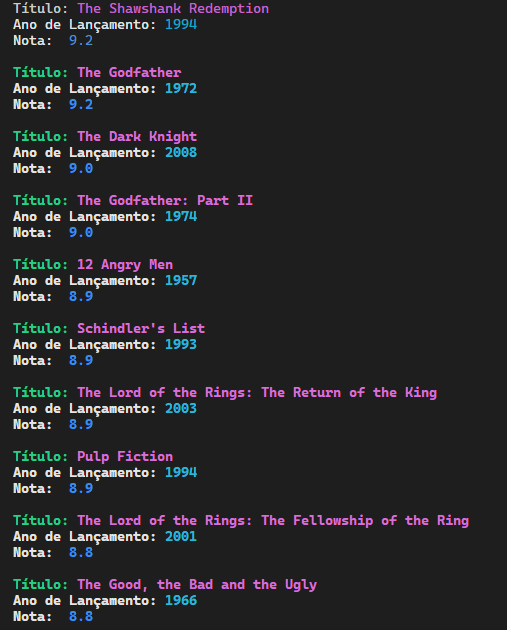

# Imersão Java Alura

Repositório com os projetos dos 5 dias de imersão.

## Dia 1

No primeiro dia o desafio foi consumir dados da API de filmes do IMDB.
Nas primeiras horas de aula no ar a API começou a apresentar instabilidades e acabei substituindo por um [link alternativo](https://raw.githubusercontent.com/alura-cursos/imersao-java-2-api/main/TopMovies.json) encontrado na página da aula.

Após acessar os dados dos filmes usei o [arquivo disponibilizado](/alura-stickers/src/JsonParser.java) para extrair os dados. Através dessa expressão regular o **JSON** foi _parseado_ e isolados para usar somente as partes desejadas.

### Desafio extra

Como desafio extra foi proposto:

- `Usar Arquivos separados para as chaves da api.` ✅
- `Output colorido no terminal` ✅

- `Emoji recomendando ou não o filme baseado na nota` ✅

## Dia 2

